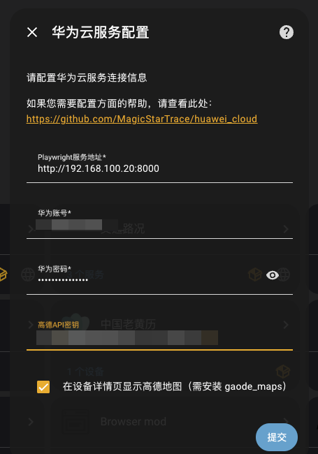
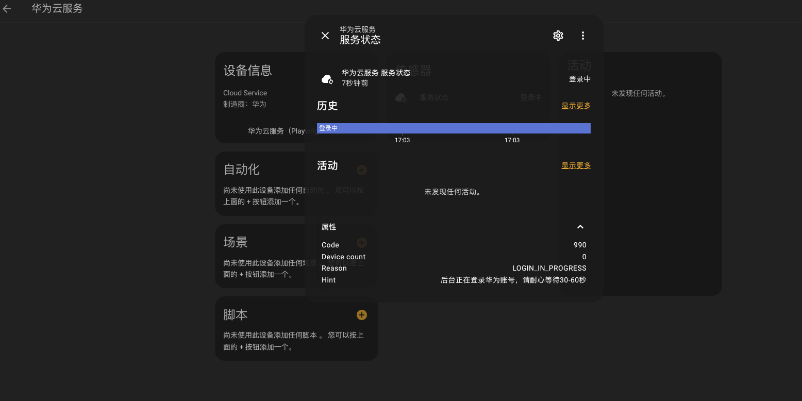
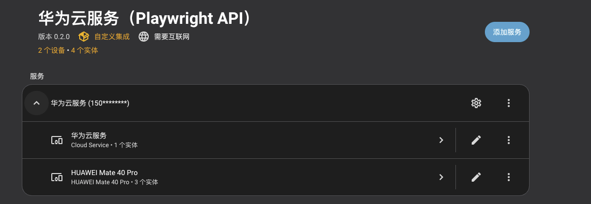
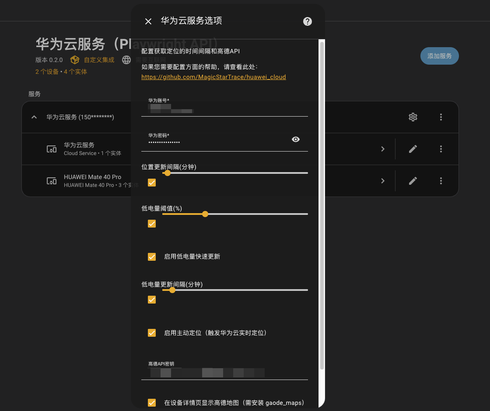
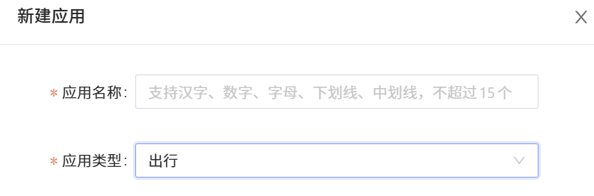
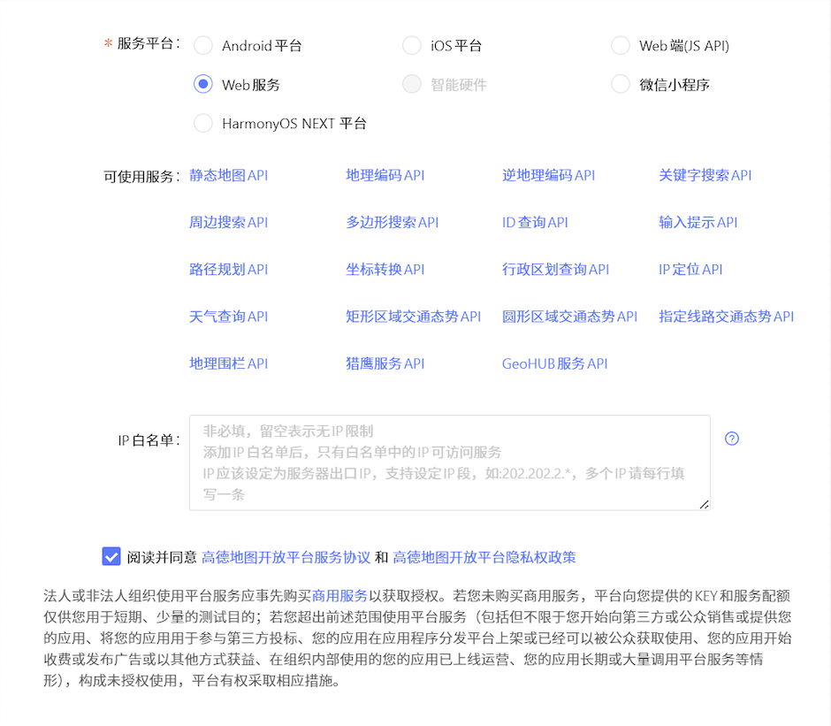
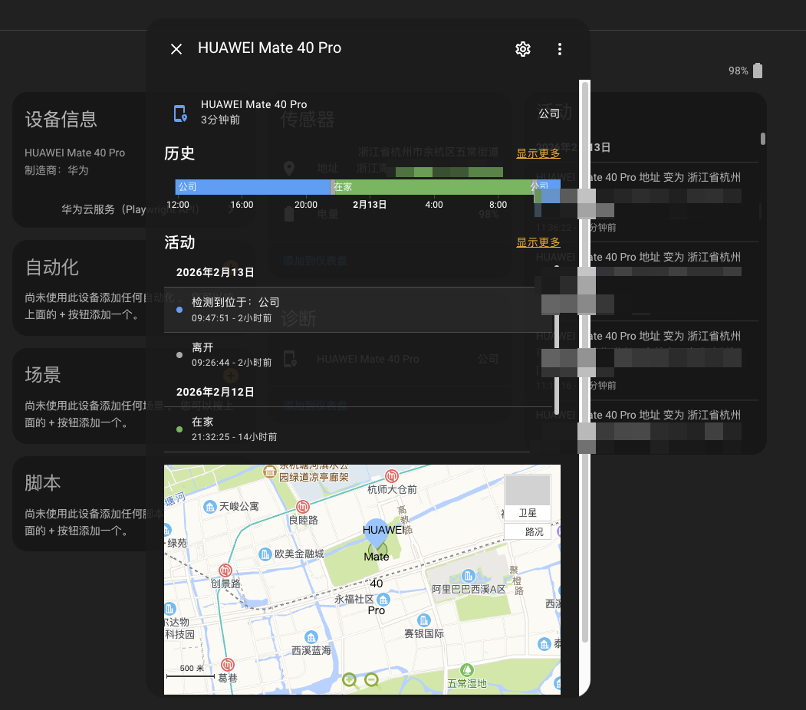

# 华为云服务集成 for Home Assistant

[](LICENSE)
[](https://hub.docker.com/r/magicstartrace/huawei-location-bridge)
[](https://hacs.xyz/)

> 通过华为云空间"查找设备"功能，将华为手机的 GPS 位置、电量等信息接入 Home Assistant。

## 它能做什么？

**基础能力**

- 在 HA 地图上实时查看你的华为设备位置
- 监控设备电量，低电量时自动加速更新
- 显示设备所在的中文地址（需配置高德 API）
- 支持多设备同时追踪
- 在设备详情页显示高德地图（需安装 [gaode_maps](https://github.com/dscao/gaode_maps)）

**典型自动化场景**

结合 HA 自动化或 Node-RED，可实现：

- **回家 / 离家围栏**：进入或离开指定区域时，自动开关灯、空调、安防
- **进入小区触发**：设备进入小区范围后自动执行回家准备流程
- **电量通知**：设备电量低于阈值时推送提醒（通知、TTS、微信等）
- **长时间未移动提醒**：设备位置长期不变时触发关怀通知，适用于老人监护场景

**Node-RED 联动**

设备追踪器实体的经纬度、电量、地址等属性可直接在 Node-RED 中使用：

- 基于 `latitude` / `longitude` 计算距离、判断围栏
- 监听 `state_changed` 事件，按设备 ID 分流处理
- 与其他 HA 实体（门锁、灯光、传感器）组合编排复杂逻辑

## 架构说明

```
Home Assistant ←→ 后端服务（Docker）←→ 华为云空间
   (本插件)      (Playwright 自动化)    (查找设备)
```

本集成分两部分：
1. **后端服务**：Docker 容器，用 Playwright 模拟浏览器登录华为云空间
2. **HA 插件**：本自定义组件，从后端获取数据并创建 HA 实体

## 安装步骤

### 第一步：部署后端服务

```bash
# 国内用户（阿里云镜像）
docker run -d \
  --name huawei-location-bridge \
  -p 8000:8080 \
  --restart unless-stopped \
  registry.cn-hangzhou.aliyuncs.com/magicstartrace/huawei-location-bridge:latest

# 海外用户（Docker Hub）
docker run -d \
  --name huawei-location-bridge \
  -p 8000:8080 \
  --restart unless-stopped \
  magicstartrace/huawei-location-bridge:latest

# 如需自定义配置（改端口、开调试等），加上 --env-file：
docker run -d \
  --name huawei-location-bridge \
  -p 8000:8080 \
  --env-file .env \
  --restart unless-stopped \
  magicstartrace/huawei-location-bridge:latest
```

> **关于数据持久化（可选）**：加上 `-v $(pwd)/data:/app/data` 可以保留登录会话，容器重启后无需重新登录。不加也能正常使用，只是每次重启容器需要重新登录（约 30-60 秒）。

验证后端是否正常运行：

```bash
curl http://你的服务器IP:8000/health
# 例如：curl http://192.168.1.100:8000/health
# 应返回 {"status": "ok", "version": "..."}
```

> 更多后端配置（Docker Compose、API 文档）请参考 [docker/README.md](docker/README.md)。

### 第二步：安装 HA 插件

**方式 A：HACS 安装（推荐）**

1. 确保已安装 [HACS](https://hacs.xyz/)
2. HACS → 集成 → 右上角三个点 → 自定义仓库
3. 添加 `https://github.com/MagicStarTrace/huawei_cloud`，类别选择 "Integration"
4. 搜索"华为云服务"并安装
5. 重启 Home Assistant

**方式 B：手动安装**

1. 下载最新 [Release](https://github.com/MagicStarTrace/huawei_cloud/releases)
2. 将 `custom_components/huawei_cloud` 复制到 HA 的 `custom_components` 目录
3. 重启 Home Assistant

### 第三步：添加集成

1. **设置 → 设备与服务 → 添加集成**
2. 搜索 **"华为云服务"**
3. 填写：
   - **后端服务地址**：如 `http://192.168.1.100:8000`
   - **华为账号** / **密码**
   - **高德 API 密钥**（可选，[申请方式见下方](#地址不显示)）

<div align="center">
  
  <br>
  <sub>在 HA 中添加集成并填写后端地址与高德 API</sub>
</div>

### 第四步：等待初始化

添加后你会看到：

1. **集成卡片立即出现**，显示"华为云服务"设备和"服务状态"传感器
2. **服务状态传感器**会实时显示当前进度：
   - `初始化中` → 正在连接后端
   - `等待登录` / `登录中` → 后端正在登录华为账号（约 30-60 秒）
   - `正常（2台设备）` → 一切就绪
3. **通知栏**会显示带进度条的初始化通知
4. 登录成功后，设备追踪器和传感器实体**自动出现**

> **首次添加需要 30-60 秒等待后端登录**，这是正常的。看到"服务状态"显示"登录中"说明一切正常，请耐心等待。

<div align="center">
  
  <br>
  <sub>初始化过程中的服务状态实体</sub>
</div>

## 创建的实体

| 实体 | 类型 | 说明 |
|------|------|------|
| 服务状态 | 传感器 | 显示后端连接状态（初始化中/登录中/正常） |
| 设备追踪器 | device_tracker | GPS 位置，在 HA 地图上显示 |
| 地址 | 传感器 | 中文地址（需高德 API 密钥） |
| 电量 | 传感器 | 电池百分比 |

每台华为设备会创建 1 个追踪器 + 2 个传感器（地址、电量）。

<div align="center">
  
  <br>
  <sub>设备实体创建完成后的整体结构</sub>
</div>

## 配置选项

添加后可在 **设置 → 设备与服务 → 华为云服务 → 配置** 中调整：

| 选项 | 说明 | 默认值 |
|------|------|--------|
| 位置更新间隔 | 多久获取一次位置 | 3 分钟 |
| 启用主动定位 | 触发实时定位（更精准但耗电） | 开启 |
| 低电量阈值 | 低于多少电量算"低电量" | 30% |
| 启用低电量快速更新 | 低电量时自动缩短更新间隔 | 开启 |
| 低电量更新间隔 | 低电量时多久更新一次 | 5 分钟 |
| 高德 API 密钥 | 坐标转中文地址 | 无 |

<div align="center">
  
  <br>
  <sub>插件详细配置页面</sub>
</div>

## 常见问题

### 添加集成后一直显示"初始化中"

- 检查后端服务是否运行：`curl http://你的服务器:8000/health`
- 确认 HA 能访问后端地址（同一网络？防火墙？）
- 查看 HA 日志中的 `huawei_cloud` 相关信息

### 服务状态显示"需要认证"

华为账号触发了验证码，后端无法自动处理。解决方法：
1. 在浏览器中手动登录 [华为云空间](https://cloud.huawei.com)
2. 完成验证码验证
3. 在 HA 中重新加载集成

### 实体显示"不可用"

- 首次启动需 30-60 秒完成登录，请等待
- 设备关机或离线时位置不可用
- 设备离线超过 1 小时后缓存过期

### 地址不显示

需要配置高德地图 API 密钥（免费额度足够个人使用），申请步骤：

1. 注册/登录 [高德开放平台](https://lbs.amap.com/)
2. 进入 **应用管理 → 我的应用 → 创建新应用**

<div align="center">
  
  <br>
  <sub>进入「应用管理 → 我的应用 → 创建新应用」</sub>
</div>

3. 应用类型选择 **出行**
4. 点击 **添加 Key**，服务平台选择 **Web服务**

<div align="center">
  
  <br>
  <sub>选择「出行」类型并添加 Web 服务 Key</sub>
</div>

5. 将获取到的 Key 填入集成配置的「高德 API 密钥」字段

### 定位不准确

- 室内 GPS 信号弱，精度较低属于正常
- 设备追踪器的 `location_accuracy` 属性显示精度（单位：米）
- 开启"主动定位"可以获得更精确的位置

<div align="center">
  
  <br>
  <sub>实体属性中显示高德地图卡片</sub>
</div>

## 坐标系说明

- Home Assistant 使用 **WGS-84** 坐标系（全球 GPS 标准）
- 设备追踪器的位置已自动转换为 WGS-84
- 如需国内地图坐标（高德/百度），可在实体属性中找到 `gcj02_latitude` / `gcj02_longitude`

<div align="center">
  
  <br>
  <sub>坐标转换后的中文地址实体展示</sub>
</div>

## ❤️ 支持项目

如对您有帮助，欢迎自愿赞赏支持项目的持续优化。

赞赏完全自愿，不影响功能使用。

感谢您的认可与支持。

<div align="center">

| 微信赞赏 | 支付宝赞赏 |
|:---:|:---:|
|  |  |

</div>

## 💬 交流与反馈

- 优先使用 GitHub Issues：适合 Bug / 功能建议 / 适配问题（请附日志与截图，便于定位）
- QQ 交流群：**1081967118**（日常交流、使用心得、公告通知）

## 免责声明

本项目仅供个人学习和研究使用。使用者应遵守相关法律法规，不得用于非法用途。使用本项目产生的任何风险由使用者自行承担。

本项目通过华为云网页端接口进行数据获取。若官方对网页端接口进行调整、升级或策略变更，可能导致短期兼容性问题。本项目不隶属于华为官方。
